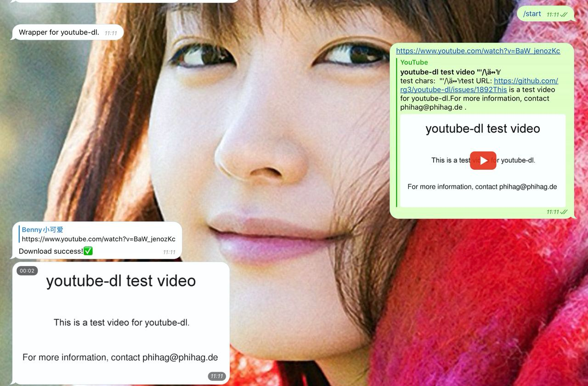

# ytdlbot

YouTube Download Bot🚀

Download videos from YouTube and other platforms through a Telegram Bot

[](https://heroku.com/deploy)

# Usage

[https://t.me/benny_ytdlbot](https://t.me/benny_ytdlbot)

Send link directly to the bot. Any
platform [supported by youtube-dl](https://ytdl-org.github.io/youtube-dl/supportedsites.html) will also work.

## Limitation of my bot

Because I have limited resources, hundreds of Gigabytes doesn't sound like a sustainable solution.

**In that case, I added one limitation: 5GiB per 24 hours for each user. Might change in future**

You can choose to become 'VIP' if you really need large traffic. And also, you could always deploy your own bot.

# Features



1. fast download and upload.
2. ads free
3. support progress bar
4. audio conversion
5. playlist support
6. VIP support

# How to deploy?

Choose your own preference.

## Heroku

Use the button above! It should work like a magic.

## Normal

1. clone code
2. install ffmpeg
3. install Python 3.6+
4. pip3 install -r requirements.txt
5. set environment variables `TOKEN`, `APP_ID` and `APP_HASH`, and more if you like.
6. `python3 ytdl.py`

## Simple one line docker

Some functions, such as VIP, ping will be disabled.

```shell
docker run -e APP_ID=111 -e APP_HASH=111 -e TOKEN=370FXI bennythink/ytdlbot
```

## docker-compose

Compatible with amd64, arm64 and armv7l

### 1. get docker-compose.yml

Download this file to a directory, for example `~/ytdl/docker-compose.yml`

### 2. create VIP database

```shell
mkdir ~/ytdl/data/
touch ~/ytdl/data/vip.sqlite
```

### 3. create env file

```shell
mkdir ~/ytdl/env/
vim ~/ytdl/env/ytdl.env
```

you can configure all the following environment variables:

* APP_ID: **REQUIRED**
* APP_HASH: **REQUIRED**
* TOKEN: **REQUIRED**
* REDIS: **REQUIRED**
* OWNER: owner username
* QUOTA: quota in bytes
* EX: quota expire time
* MULTIPLY: vip quota comparing to normal quota
* USD2CNY: exchange rate
* VIP: enable VIP or not, default: disable
* AFD_LINK
* COFFEE_LINK
* COFFEE_TOKEN
* AFD_TOKEN
* AFD_USER_ID
* WORKERS: default 100

### 4. run

```
docker-compose up -d
```

# Command

```
start - Let's start
about - Want to contribute?
ping - Bot running status
help - Anything troubles you?
ytdl - Download video in group
vip - Join VIP
terms - View Terms of Service
```

# Test video

https://www.youtube.com/watch?v=BaW_jenozKc

# Test Playlist

https://www.youtube.com/playlist?list=PL1Hdq7xjQCJxQnGc05gS4wzHWccvEJy0w

# License

Apache License 2.0
