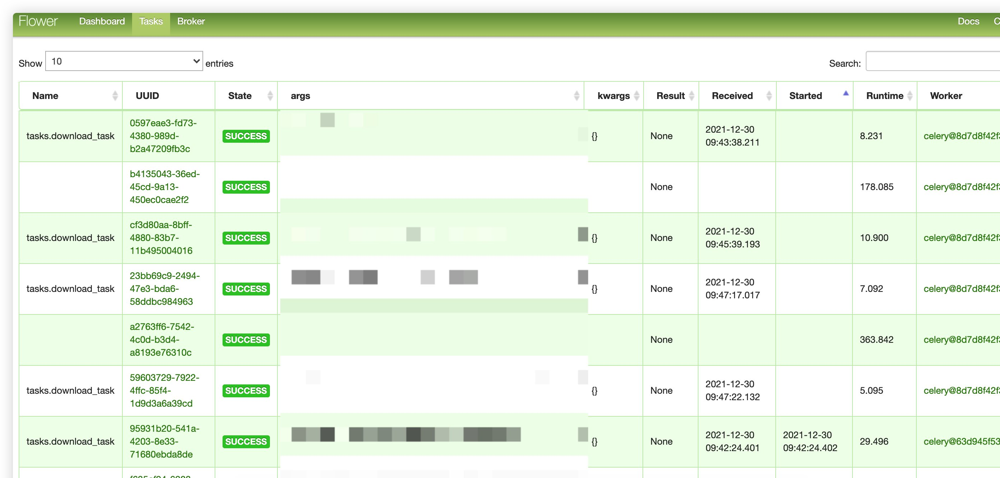

# ytdlbot

[](https://github.com/tgbot-collection/ytdlbot/actions/workflows/builder.yaml)

YouTube Download Bot🚀

Download videos from YouTube and other platforms through a Telegram Bot

-----
**READ [FAQ](FAQ.md) FIRST IF YOU ENCOUNTER ANY ISSUES.**

-----
[](https://heroku.com/deploy)

Can't deploy? Fork to your personal account and deploy it there!

**Starting November 28, 2022, free Heroku Dynos, free Heroku Postgres, and free Heroku Data for Redis® plans will no
longer be available.**
[Heroku Announcement](https://devcenter.heroku.com/articles/free-dyno-hours)

# Usage

[https://t.me/benny_ytdlbot](https://t.me/benny_ytdlbot)

Send link directly to the bot. Any
Websites [supported by youtube-dl](https://ytdl-org.github.io/youtube-dl/supportedsites.html) will also work.

# Limitations of my bot

I don't have unlimited servers and bandwidth, so I have to make some restrictions.

* 5 GiB one-way traffic per 24 hours for each user
* maximum 5 minutes streaming conversion support
* maximum 3 subscriptions
* limited request in certain time range

You can choose to become 'VIP' if you really need large traffic. And also, you could always deploy your own bot.

# Features


1. fast download and upload.
2. ads free
3. support progress bar
4. audio conversion
5. playlist support
6. VIP support
7. support different video resolutions
8. support sending as file or streaming as video
9. supports celery worker distribution - faster than before.
10. subscriptions to YouTube Channels
11. cache mechanism - download once for the same video.



# How to deploy?

You can deploy this bot on any platform that supports Python.

## Heroku

Use the button above! It should work like a magic but with limited functionalities.

## Run natively on your machine

1. clone code
2. install ffmpeg
3. install Python 3.6+
4. install aria2 and add to PATH
5. pip3 install -r requirements.txt
6. set environment variables `TOKEN`, `APP_ID` and `APP_HASH`, and more if you like.
7. `python3 ytdl_bot.py`

## Docker

Some functions, such as VIP, ping will be disabled.

```shell
docker run -e APP_ID=111 -e APP_HASH=111 -e TOKEN=370FXI bennythink/ytdlbot
```

# Complete deployment guide for docker-compose

* contains every functionality
* compatible with amd64, arm64 and armv7l

## 1. get docker-compose.yml

Download `docker-compose.yml` file to a directory

## 2. create data directory

```shell
mkdir data
mkdir env
```

## 3. configuration

### 3.1. set environment variables

```shell
vim env/ytdl.env
```

you can configure all the following environment variables:

* PYRO_WORKERS: number of workers for pyrogram, default is 100
* WORKERS: workers count for celery
* APP_ID: **REQUIRED**, get it from https://core.telegram.org/
* APP_HASH: **REQUIRED**
* TOKEN: **REQUIRED**
* REDIS: **REQUIRED if you need VIP mode and cache** ⚠️ Don't publish your redis server on the internet. ⚠️

* OWNER: owner username
* QUOTA: quota in bytes
* EX: quota expire time
* MULTIPLY: vip quota comparing to normal quota
* USD2CNY: exchange rate
* VIP: VIP mode, default: disable
* AFD_LINK
* COFFEE_LINK
* COFFEE_TOKEN
* AFD_TOKEN
* AFD_USER_ID

* AUTHORIZED_USER: users that could use this bot, user_id, separated with `,`
* REQUIRED_MEMBERSHIP: group or channel username, user must join this group to use the bot. Could be use with
  above `AUTHORIZED_USER`

* ENABLE_CELERY: Distribution mode, default: disable. You'll can setup workers in different locations.
* ENABLE_FFMPEG: enable ffmpeg so Telegram can stream
* MYSQL_HOST: you'll have to setup MySQL if you enable VIP mode
* MYSQL_USER
* MYSQL_PASS
* GOOGLE_API_KEY: YouTube API key, required for YouTube video subscription.
* AUDIO_FORMAT: audio format, default is m4a. You can set to any known and supported format for ffmpeg. For
  example,`mp3`, `flac`, etc. ⚠️ m4a is the fastest. Other formats may affect performance.
* ARCHIVE_ID: group or channel id/username. All downloads will send to this group first and then forward to end user.
* PLAYLIST_SUPPORT: `True` or `False`, Ability to enable or disable downloads of playlist / channels by bot. Default: `False`.
  **Inline button will be lost during the forwarding.**

## 3.2 Set up init data

If you only need basic functionality, you can skip this step.

### 3.2.1 Create MySQL db

Required for VIP, settings, YouTube subscription.

```shell
docker-compose up -d
docker-compose exec mysql bash

mysql -u root -p

> create database ytdl;
```

### 3.2.2 Setup flower db in `ytdlbot/ytdlbot/data`

Required if you enable celery and want to monitor the workers.

```shell
{} ~ python3
Python 3.9.9 (main, Nov 21 2021, 03:22:47)
[Clang 12.0.0 (clang-1200.0.32.29)] on darwin
Type "help", "copyright", "credits" or "license" for more information.
>>> import dbm;dbm.open("flower","n");exit()
```

### 3.2.3 Setup instagram cookies

Required if you want to support instagram.

You can use this extension
[Get cookies.txt](https://chrome.google.com/webstore/detail/get-cookiestxt/bgaddhkoddajcdgocldbbfleckgcbcid)
to get instagram cookies

```shell
vim  data/instagram.com_cookies.txt
# paste your cookies
```

## 3.3 Tidy docker-compose.yml

In `flower` service section, you may want to change your basic authentication username password and publish port.

You can also limit CPU and RAM usage by adding an `deploy' key:

```docker
    deploy:
      resources:
        limits:
          cpus: '0.5'
          memory: 1500M
```

Be sure to use `--compatibility` when deploying.

## 4. run

### 4.1. standalone mode

If you only want to run the mode without any celery worker and VIP mode, you can just start `ytdl` service

```shell
docker-compose up -d ytdl
```

### 4.2 VIP mode

You'll have to start MySQL and redis to support VIP mode, subscription and settings.

```
docker-compose up -d mysql redis ytdl
```

### 4.3 Celery worker mode

Firstly, set `ENABLE_CELERY` to true. And then, on one machine:

```shell
docker-compose up -d
```

On the other machine:

```shell
docker-compose -f worker.yml up -d
```

**⚠️ Bear in mind don't publish redis directly on the internet! You can use WireGuard to wrap it up.**

## Kubernetes

Kubernetes, also known as K8s, is an open-source system for automating deployment, scaling, and management of
containerized applications

# Complete deployment guide for k8s deloyment

* contains every functionality
* compatible with amd64, arm64 and armv7l

## First. Get all file in k8s folder

Download `k8s` file to a directory on your k8s server and go to this folder

## 1. Create Redis deloyment

```shell
kubectl apply -f 01.redis.yml
```

This command will create ytdl namespace, redis pod and redis service

## 2. Creat MariaDB deloyment

```shell
kubectl apply -f 02.mariadb.yml
```

This deloyment will claim 10GB storage from storageClassName: longhorn. Please replace longhorn with your
storageClassName before apply.

## 3. Set environment variables

Create configMap for env

### 3.1 Edit configmap.yml

```shell
vim 03.configmap.yml
```

you can configure all the following environment variables:

* PYRO_WORKERS: number of workers for pyrogram, default is 100
* WORKERS: workers count for celery
* APP_ID: **REQUIRED**, get it from https://core.telegram.org/
* APP_HASH: **REQUIRED**
* TOKEN: **REQUIRED**
* REDIS: **REQUIRED if you need VIP mode and cache** ⚠️ Don't publish your redis server on the internet. ⚠️

* OWNER: owner username
* QUOTA: quota in bytes
* EX: quota expire time
* MULTIPLY: vip quota comparing to normal quota
* USD2CNY: exchange rate
* VIP: VIP mode, default: disable
* AFD_LINK
* COFFEE_LINK
* COFFEE_TOKEN
* AFD_TOKEN
* AFD_USER_ID

* AUTHORIZED_USER: users that could use this bot, user_id, separated with `,`
* REQUIRED_MEMBERSHIP: group or channel username, user must join this group to use the bot. Could be use with
  above `AUTHORIZED_USER`

* ENABLE_CELERY: Distribution mode, default: disable. You'll can setup workers in different locations.
* ENABLE_FFMPEG: enable ffmpeg so Telegram can stream
* MYSQL_HOST: you'll have to setup MySQL if you enable VIP mode
* MYSQL_USER
* MYSQL_PASS
* GOOGLE_API_KEY: YouTube API key, required for YouTube video subscription.
* AUDIO_FORMAT: audio format, default is m4a. You can set to any known and supported format for ffmpeg. For
  example,`mp3`, `flac`, etc. ⚠️ m4a is the fastest. Other formats may affect performance.
* ARCHIVE_ID: group or channel id/username. All downloads will send to this group first and then forward to end user.
  **Inline button will be lost during the forwarding.**

### 3.2 Apply configMap for environment variables

```shell
kubectl apply -f 03.configmap.yml
```

## 4. Run Master Celery

```shell
kubectl apply -f 04.ytdl-master.yml
```

This deloyment will create ytdl-pvc PersistentVolumeClaim on storageClassName: longhorn. This clain will contain vnstat,
cookies folder and flower database. Please replace longhorn with your storageClassName before apply

### 4.1 Setup instagram cookies

Required if you want to support instagram.

You can use this extension
[Get cookies.txt](https://chrome.google.com/webstore/detail/get-cookiestxt/bgaddhkoddajcdgocldbbfleckgcbcid)
to get instagram cookies

Get pod running ytdl master:

```shell
kubectl get pods --namespace ytdl
```

Name should be ytdl-xxxxxxxx

Access to pod

```shell
kubectl --namespace=ytdl exec --stdin --tty ytdl-xxx -- sh
```

(replace ytdl-xxx by your pod name)

Go to ytdl-pvc mounted folder

```shell
cd /ytdlbot/ytdlbot/data/
vim  instagram.com_cookies.txt
# paste your cookies
```

## 5. Run Worker Celery

```shell
kubectl apply -f 05.ytdl-worker.yml
```

## 6. Run Flower image (OPTIONAL)

### 6.1 Setup flower db

Get pod running ytdl master:

```shell
kubectl get pods --namespace ytdl
```

Name should be ytdl-xxxxxxxx

Access to pod

```shell
kubectl --namespace=ytdl exec --stdin --tty ytdl-xxx -- sh
```

(replace ytdl-xxx by your pod name)

Go to ytdl-pvc mounted folder

```shel
cd /var/lib/vnstat/
```

Create flower database file

```shell
{} ~ python3
Python 3.9.9 (main, Nov 21 2021, 03:22:47)
[Clang 12.0.0 (clang-1200.0.32.29)] on darwin
Type "help", "copyright", "credits" or "license" for more information.
>>> import dbm;dbm.open("flower","n");exit()
```

### 6.2 Config Flower Ingress

This step need config ingress from line 51 of file 06.flower.yml with your ingress service. Need for access from
internet.
YML file should be adjusted depending on your load balancing, ingress and network system

For active SSL

```yml
cert-manager.io/cluster-issuer: letsencrypt-prod
```

Replace nginx by your ingress service

```yml
ingressClassName: nginx
```

Add your domain, example

```yml
tls:
  - hosts:
      - flower.benny.com
    secretName: flower-tls
  rules:
    - host: flower.benny.com
```

### 6.3 Apply Flower deloyment

```shell
kubectl apply -f 06.flower.yml
```

# Command

```
start - Let's start
about - What's this bot?
ping - Bot running status
help - Help
ytdl - Download video in group
vip - Join VIP
settings - Set your preference
direct - Download file directly
sub - Subscribe to YouTube Channel
unsub - Unsubscribe from YouTube Channel
sub_count - Check subscription status, owner only.
uncache - Delete cache for this link, owner only.
purge - Delete all tasks , owner only.
topup - Top up quota
tgvip - Using Telegram payment to pay for VIP
```

# Test data

## Test video

https://www.youtube.com/watch?v=BaW_jenozKc

## Test Playlist

https://www.youtube.com/playlist?list=PL1Hdq7xjQCJxQnGc05gS4wzHWccvEJy0w

## Test m3u8

https://dmesg.app/m3u8/prog_index.m3u8

## test twitter

https://twitter.com/nitori_sayaka/status/1526199729864200192
https://twitter.com/BennyThinks/status/1475836588542341124

# Donation

* [Buy me a coffee](https://www.buymeacoffee.com/bennythink)
* [Afdian](https://afdian.net/@BennyThink)
* [GitHub Sponsor](https://github.com/sponsors/BennyThink)

## Stripe

You can choose to donate via Stripe. Please click the button below to donate via Stripe.
Choose the currency and payment method that suits you.

| USD(Card, Apple Pay and Google Pay)              | SEK(Card, Apple Pay and Google Pay)              | CNY(Card, Apple Pay, Google Pay and Alipay)      |
|--------------------------------------------------|--------------------------------------------------|--------------------------------------------------|
| [USD](https://buy.stripe.com/cN203sdZB98RevC3cd) | [SEK](https://buy.stripe.com/bIYbMa9JletbevCaEE) | [CNY](https://buy.stripe.com/dR67vU4p13Ox73a6oq) |
|                               |                               |                               |

# License

Apache License 2.0
